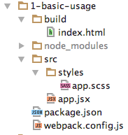
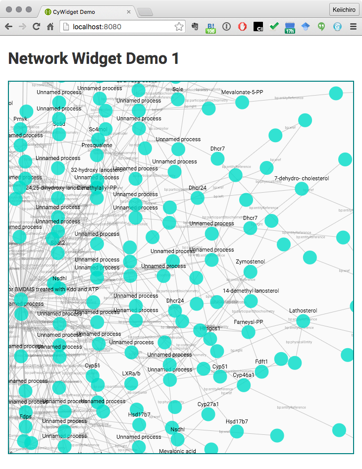
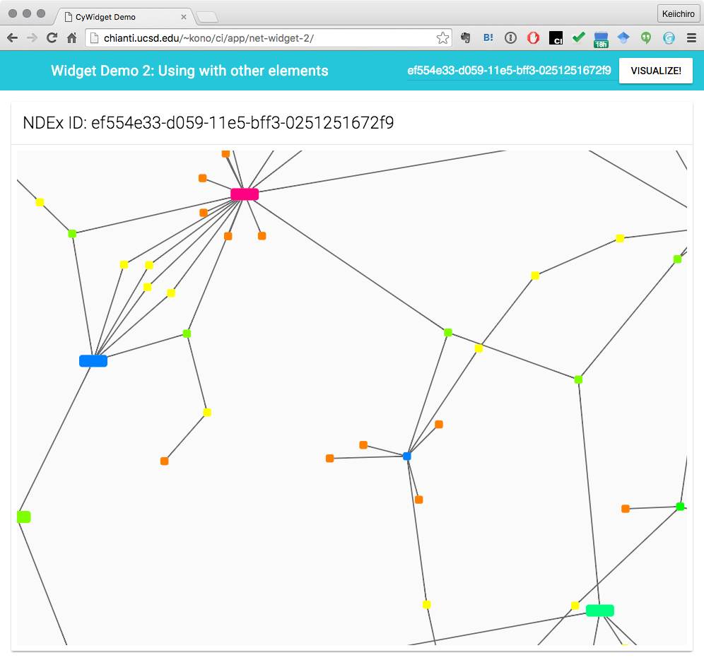
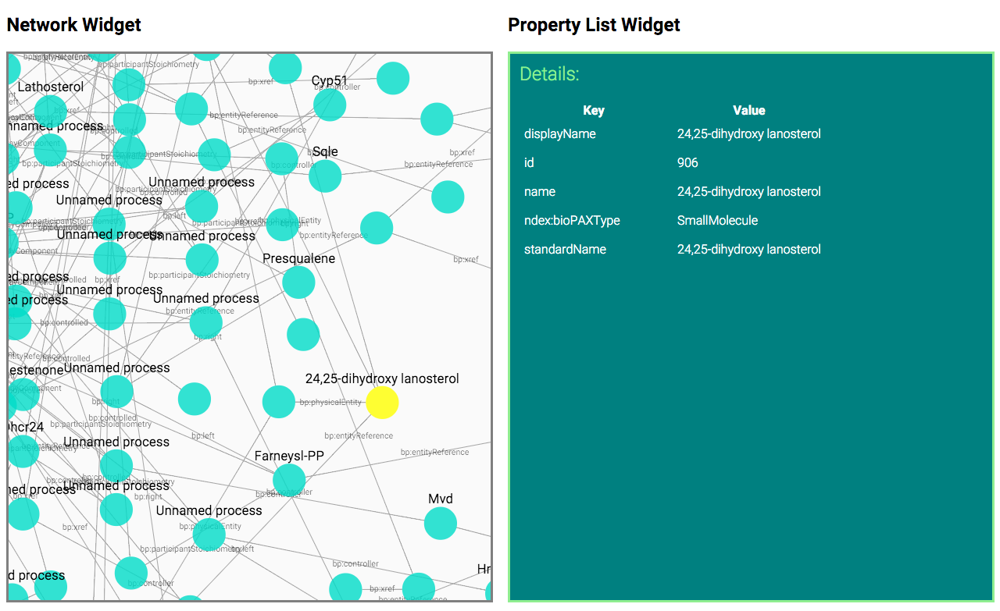

# Samples Web Applications using CyWidget

## Introduction
This repository contains several example web applications using CyWidget.

## System Requirements

* [node.js](https://nodejs.org/en/)
  * Tested on 5.6+

## Basic Project Structure



You can use this project as a template of your web application's front-end code.  Of course, you can write entire web application without any build tool, but we recommnend to use _npm_ with _webpack_ for automatic build.

In general, the only files you need to edit for using CyWidgets are the following:  

### ```build/index.html```
HTML 5 document to be used as the main page of your project.  It includes a tag to be used by the widget.  Other than that, you can add any other tags you need to build your application's entry page.

### ```src/app.jsx```
The entry point of your web application.  You need to call widgets from here.

### ```src/styles/app.scss```
Main style file for your app.  This is written in SCSS, but you can compile it into regular CSS with a npm command (will be discussed later).

### ```package.json```
Just a standard [npm setting file](https://docs.npmjs.com/files/package.json).  You can manage version number of your application or dependencies by editing this.

## How to Run
All sample projects have same basic structure and you can run it by 

1. Make sure you have node.js installed.
1. ```cd PROJECT_NAME``` where _PROJECT\_NAME_ is a sub-directory name in this repository.
1. ``` npm install``` - This installs all dependencies required to build and run the sample applicaitons.
1. ```npm run dev``` - This builds and runs the application. 
1. Open ```http://localhost:8080/``` with your web browser
1. Every time you modify something in your JavaScript or style files, it automatically rebuild and reload the page.

## Build and Deploy the App
Type ```npm run build``` to build a new application.  It will creates a new file ```app.js``` under ```build``` directory.  You can simply copy the contents in the directory to any web servers to deploy the app.

## Descriptions

### 1. Basic Usage



* [Demo Page](http://chianti.ucsd.edu/~kono/ci/app/net-widget-1/)

This is the _Hello-World_ project for all CyWidget users.  It simply visualizes network data from external data source.  Please read _app.jsx_ code first.  You will learn how to use CyWidgets by reading the code and comments in the file.    

### 2. Use with other components



* [Demo Page](http://chianti.ucsd.edu/~kono/ci/app/net-widget-2/)

This example demonstrates how to use the widget with other standard JavaScript code and CSS frameworks.  In this example, basic layout is controlled by [Material Design Lite](http://getmdl.io/index.html) framework.  You can pass parameters from those 3rd party components and pass them to the widget as parameters. 

### 3. Multiple widgets sharing events


* [Demo Page](http://chianti.ucsd.edu/~kono/ci/app/net-widget-3/)

This is an example to demonstrate how multiple widgets work together to build an application.  You have to register both _reducers_ to use multiple widgets:

```js
const cy = new CytoFramework({graphReducer, tableReducer});
```

And then you can call _render_ runction to display widgets:

```js
cy.render(document.getElementById('widget-table'), CyPropTableWidget);
cy.render(document.getElementById('widget-network'), CyNetworkWidget, props);
```
